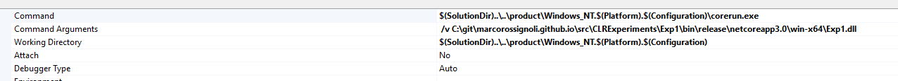

### DEBUG with CoreRun.exe

https://github.com/dotnet/coreclr/blob/master/Documentation/building/debugging-instructions.md   


VS options


Command: `$(SolutionDir)..\..\product\Windows_NT.$(Platform).$(Configuration)\corerun.exe`  
Command Arguments: `/v ...\Exp1.dll`  <-- .net main dll to debug  
WorkingDirectory: `$(SolutionDir)..\..\product\Windows_NT.$(Platform).$(Configuration)`

#### Build

First build
``` bash
build -skiptests
``` 

Build only native after updates 
``` bash
C:\git\coreclr (master -> origin)
λ build -skipmscorlib -skiptests -skipbuildpackages
```
